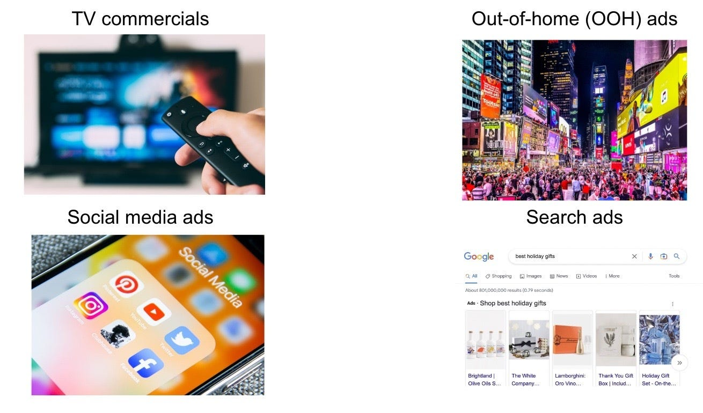
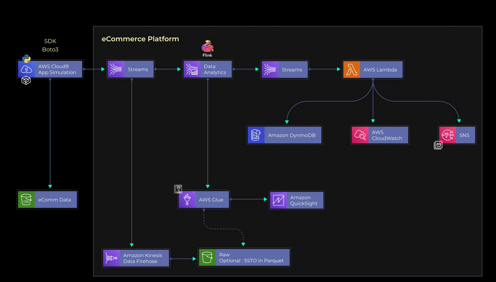
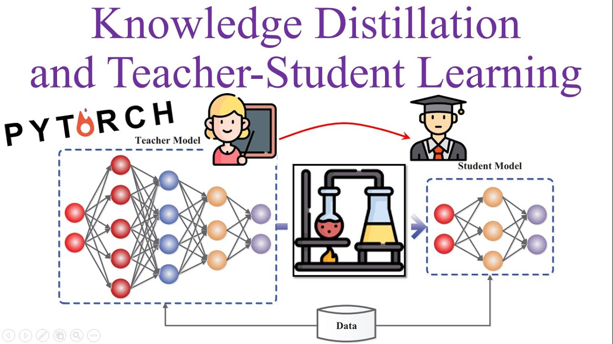

# Data Analyst

#### Technical Skills
- Data analysis/wrangling skills using SQL/Python/SAS
- Data visualization and storytelling skills using Power BI
- Cloud computing skills in AWS

## About me
From the first year of my bachelor’s degree, I was drawn to the world of data. What began as curiosity quickly turned into a passion, ultimately leading me to earn a Master’s degree in Data Analytics with a focus on business applications.

During my master’s program, I worked on a capstone project with Property Brokers, where I gained hands-on experience with real business data from the New Zealand property market. This project allowed me to refine my ability to transform raw data into actionable insights. I built an interactive Power BI dashboard to visualise key metrics and trends, helping stakeholders make data-driven decisions. Additionally, I developed machine learning models to classify property maintenance jobs and predict maintenance costs based on property attributes, enhancing operational efficiency.

Beyond analytics, I have a strong foundation in data engineering. In one of my key projects, I designed and implemented a data lakehouse architecture to facilitate scalable data storage, transformation, and analysis. I ingested raw Parquet files into MiniO, and leveraged PySpark for data transformation and cleaning. The processed data was stored as an Apache Iceberg table format, ensuring efficient querying and versioning. The entire project was containerised using Docker, enabling seamless deployment across various environments.

In addition to technical expertise, I have experience applying multivariate analysis and econometric models to uncover customer insights and measure the return on investment in marketing campaigns. My ability to blend data engineering, analytics, and machine learning allows me to bridge the gap between raw data and meaningful business outcomes.

## Education							       		
- M.S., Analytics	| Massey University (_Feb 2025_)	 			        		
- B.S., Computer Science | Frankfurt University of Applied Sciences (_Oct 2023_)

## Work Experience
**Data Scientist @ Metrovate, New Zealand (_June 2025 - Present_)**
- Developed a machine learning model to accelerate the design of novel synthetic protein sequences with high binding affinity to a target-defined receptor.
- Utilised UV, GitHub, and GitHub Project Boards to manage tasks and collaborate with team members, ensuring smooth project workflow, library management, and version control.
- Worked closely with team leads to define project requirements and data needs, ensuring alignment between technical development and research objectives.

**Data Analyst @ Property Brokers, New Zealand (_Dec 2024 - Feb 2025_)**
- Resolved data quality issues for predictive models and Power BI dashboards such as inconsistent formats and duplicate records with SQL and Python
- Built Power BI dashboards visualising portfolio trends, rental performance, and maintenance patterns, improving stakeholder engagement and understanding of operational data.
- Developed a statistical regression model that explained 56% of weekly rent variance, providing data-driven insights into rental pricing factors.
- Developed an ensemble predictive model achieving 42.61% accuracy in forecasting property maintenance tasks and costs, supporting proactive budgeting for property managers and landlords.
- Presented complex analytical findings to non-technical stakeholders through clear visualisations, a written report, and a PowerPoint presentation, enhancing data-driven decision-making.

## Projects
### [Data Analyst – Advertising ROI | The Warehouse, New Zealand – Retail](https://github.com/benminh121/thewarehouse_romi)

Analysed advertising and sales data from The Warehouse to evaluate the short- and long-term impact of media channels using econometric modelling, AdStock, and ROMI analysis. This data-driven approach identified Digital and Press as the most effective channels, while highlighting inefficiencies in Mailer, Television, and Radio. The optimised allocation strategy demonstrated two outcomes: a potential 2.31% increase in sales without additional budget, or an 5% budget reduction while maintaining the same sales level. The project provides a practical framework for profit-driven media optimisation and strategic marketing investment.

### [Data Engineer - Analytical Platform with AWS | eCommerce](https://github.com/benminh121/ecommAWS)

Developed comprehensive analytical pipelines for eCommerce user behaviour and platform activity using AWS services. This data-driven approach enabled deeper understanding of the full customer journey, from discovery and acquisition to conversion and retention. The project combined Batch processing with Lake House architecture to visualise key metrics such as unique visitors, cart abandonment trends, top product categories, and brand performance, while Real-time analytics detected DDoS and bot attacks to secure platform integrity. The solution provides an automated, scalable, and actionable framework for driving business insights and optimising marketing and operational strategies.

### [Image Classification with PyTorch](https://github.com/benminh121/2025-Phase-2-Data-Science-Ben-Nguyen/tree/main/3.%20Deep%20Learning%20Project)

Developed a knowledge distillation framework for image classification using a ResNet34 teacher and a ResNet18 student model. This data-driven approach enabled the student model to achieve competitive classification accuracy while maintaining a substantially smaller size and lower computational cost. The proposed method provides an efficient and scalable strategy for deploying deep learning models in resource-constrained environments without significant loss of performance.

## Contacts
- LinkedIn: [@bennguyen](https://www.linkedin.com/in/bennguyen1201/)
- Email: nguyenthaiminh1201@gmail.com
